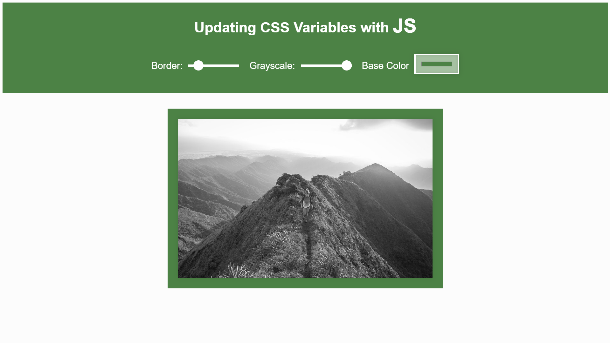

# JavaScript 30 Challenge. Day 3 Scoped CSS Variables and JS

> Based on https://javascript30.com/

## WHAT WAS NEW
* Working with `input type="color"`
* Working with CSS filters

## USED LIBRARIES
* TinyColor v1.4.1 https://github.com/bgrins/TinyColor
